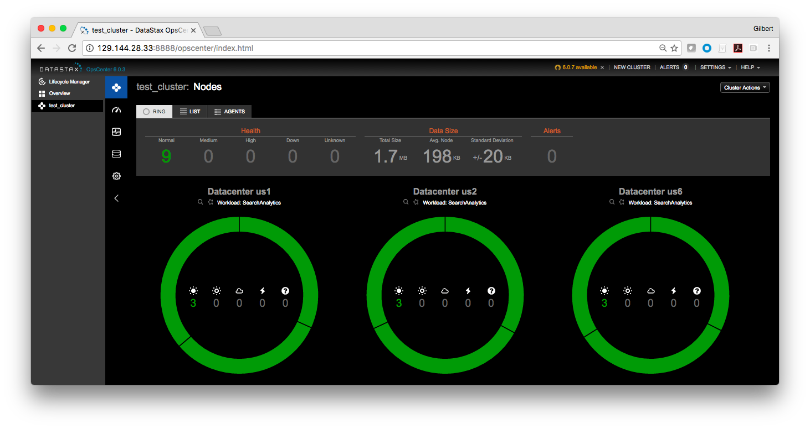

# oracle-public-cloud-dse [LCM]

Scripts for deploying DataStax Enterprise (DSE) to Oracle Compute Cloud (OCC)

These scripts use the Oracle Compute Cloud (OCC) [CLI](https://docs.oracle.com/cloud-machine/latest/stcomputecs/ELUCL/GUID-A377A4D6-8A3E-43EF-B069-5C4EA50D7E6D.htm#ELACI113) to deploy a DataStax Enterprise cluster in an OCC environment:

The DataStax [Oracle Cloud Deployment Guide](https://github.com/DSPN/oracle-cloud-deployment-guide) is a good place to learn about best practices for Oracle Cloud.

|Directory | Description |
|----------|-------------|
|[extensions](./extensions) | Common scripts that are used by OCC instance's bootstrapping process. In OCC terminology, this process is referred as "Automating Instance Configuration Using opc-init".  You can learn more about this [here](http://docs.oracle.com/cloud/latest/stcomputecs/STCSG/GUID-C63680F1-1D97-4984-AB02-285B17278CC5.htm#STCSG-GUID-C63680F1-1D97-4984-AB02-285B17278CC5).|
|[root](https://github.com/DSPN/oracle-compute-cloud-dse/tree/master/) | Python and bash scripts to generate OCC CLI compliant json templates to stand up a DataStax Enterprise cluster in an OCC environment.|

## Deploying to Oracle Compute Cloud

This document describes how to deploy a DataStax Enterprise (DSE) cluster in an Oracle Compute Cloud (OCC) environment.  Below is the high level procedure to successfully deploy a DSE cluster.

1. Obtain your Oracle Compute Cloud (OCC) account
2. Set up your workstation with Oracle Compute Cloud Service Command Line Tool
3. Install our assets on your workstation to provision DSE cluster in OCC
4. Update the clusterParameters.json to reflect your own settings
5. Run the deploy.sh to deploy a DSE cluster in your OCC environment

### 1. Obtain your Oracle Compute Cloud account
If you do not have an account with OCC yet, please follow this [link](https://myaccount.cloud.oracle.com/mycloud/faces/trialsignup.jspx?serviceType=IAASMB) to apply for one.

### 2. Set up your workstation with OCC Command Line Tool
You have two options to set up your workstation.  The first option is to create a local Oracle Enterprise Linux 6.7 virtual machine on your destktop.  The second option is to create an OEL 6.7 virtual machine instance inside your OCC account.  
        
Once you got this virtual machine or OCC instance up and running, you can follow this [link](http://docs.oracle.com/cloud/latest/stcomputecs/STCLR/GUID-62B0B2BD-A95F-4F82-B144-8C1DBA8760E9.htm#STCLR-GUID-62B0B2BD-A95F-4F82-B144-8C1DBA8760E9) 
to set up your Oracle Compute Cloud Service CLI, the required environment variables, and other files.

### 3. Install DSPN assets on your workstation to provision a DSE cluster in OCC
At this point, you should have your OCC CLI environment variables namely OPC_API, OPC_USER, and a plain-text file storing your OCC account's password all setup already. I would highly encourage you to store your environment variables in your .bash_profile file.

In your local root or user account of your workstation, you need to do the followings:

Follow this [link](https://docs.oracle.com/cloud/latest/stcomputecs/STCSG/GUID-EE29085A-79B1-4A3A-BF25-A2A9516EC5F3.htm#OCSUG149) to generate an SSH key pair so you can use the private key to log in to your DataStax cluster instances using SSH.
 
Clone the repo localy using the following command:
 
    git clone https://github.com/DSPN/oracle-public-cloud-dse.git

### 4. Update the clusterParameters.json file to reflect your OCC environment settings
Run tis command:
```
    cd oracle-public-cloud-dse
```
In this directory, there is a file called 'clusterParameters.json' that looks like the following.

```json
 {
   "locations": { 
    "Oracle_Public_Cloud_DC_us1": "https://api-z27.compute.us6.oraclecloud.com/"
  },
  "OPC_DOMAIN" : "/Compute-usoracle16406",
  "OPC_USER" : "/Compute-usoracle16406/gilbert.lau@datastax.com",
  "nodeCount" : 2,
  "vmType" : "oc4",
  "osImage": "/oracle/public/OL_6.7_3GB-1.3.0-20160411",
  "bootDriveSizeInBytes" : "10737418240",
  "appDataDriveSizeInBytes" : "42949672960",
  "networkPrefix" : "DSE_IP_",
  "sshKey": "dse-occ-ssh",
  "securityList": "DSE_Seclist",
  "securityRules": "DSE_Rules"
 }
 ```

In the clusterParameters.json template, you will need to edit the following:

* "us1" is a label to decribe your Oracle data center.  You can change it to any name best describes your data center location.
* "https://api-z27.compute.us6.oraclecloud.com/" is the API endpoint of your specific OCC data center which is the same value of your OPC_API environment variable. Again, this [link](http://docs.oracle.com/cloud/latest/stcomputecs/STCSA/SendRequests.html) shows you how to find your API endpoint information.  Replace it with your own value.
* "locations" element is a list.  This means you can specify as many data centers as required for your deployment.
* OPC_DOMAIN is your OCC's Compute-identity domain.
* OPC_USER is of the same value of your OPC_USER environment variable.
* nodeCount is the number of Cassandra cluster nodes you want to deploy in each data center you specify above.
* vmType is the Oracle Public Cloud instance type.  For DataStax Enterprise, the minimum requirement is 2 CPU cores and 8 GB Memory.  Please refer to this [link](https://cloud.oracle.com/compute?tabname=PricingInfo) for different compute shapes.
* osImage is the OS image type supported by OCC.  For this integration, you need to keep this value: "/oracle/public/OL_6.7_3GB-1.3.0-20160411".
* bootDriveSizeInBytes is the size of the boot volumne where you would store your operating system.  In OCC, this is defaulted to a HDD.
* appDataDriveSizeInBytes is the size of your low latency drive for storing your Cassandra database data.
* networkPrefix is the prefix you can define for your static IPs' names.
* sshKey is the label of your sshkey in your OCC environment.  You can assign any name your want.  You will later use this value as the first argument for "deploy.sh" script in step 5 below.
* securityList is name of your security list used for your DataStax Enterprise cluster deployment.  Our current release will ignore this iput. We use OCC default security list instead.
* securityRules is the name of your security rules used for your DataStax Enterprise cluster deployment.   Our current release will ignore it since we use OCC default security list.
 
### 5. Run the deploy.sh script to deploy a DSE cluster in your OCC environment

At this point, you can run the following command to deploy your DataStax Enterprise cluster:

    ./deploy.sh  \<sshKey>  \<public ssh-key's full filename>  \<full filename of the plain-text file storing your OCC password> \<private ssh-key's full filename> \<cassandra DB user's password>

For example:

    ./deploy.sh  dse-occ-ssh  ~opc/.ssh/dse_opc_key.pub  ~opc/oracle-compute-cloud-dse-master/pwdFile ~opc/.ssh/dse_opc_key guesswhat!
 
It typically takes about 25 minutes to provision a cluster comprising four DataStax Enterprise nodes and one OpsCenter instance.  When all your DataStax OCC instances are all up and running, you can point your web browser to your OpsCenter instance. Your OpsCenter's dashboard will be accessible at port 8888 as shown below:
 

